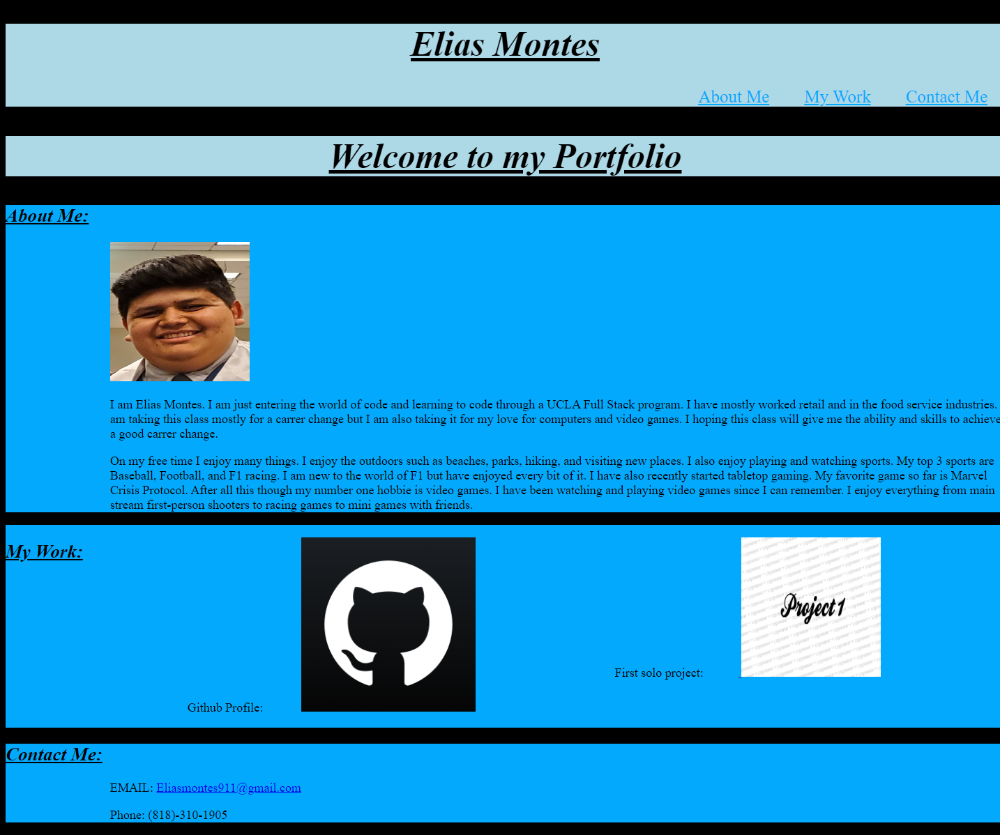

# CSS-Module-2-Challenge

## Project Details
    
In this project I was tasked with building a protfolio about myself. I first had many struggles and roadblocks but gladly I was able to get around them. In this portfolio you will see an img of me with a two paragraphs describing myself. A section with some work I have completed. Finally, a section with contact information on how to reach me. 

## Live Webpage
https://elias-montes.github.io/CSS-Module-2-Challenge/

## Special Thanks

To google and stack overflow

To Ruben Ruiz